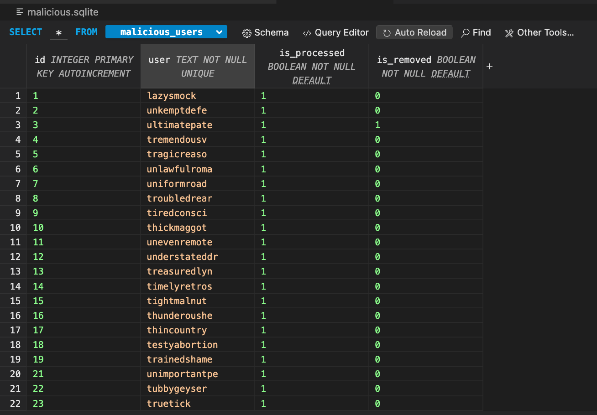

# botnet-searcher

A program to search for GitHub bot users from the article ["Found a group of malicious Go projects injected with trojan"](https://alexandear.github.io/posts/2025-02-28-malicious-go-programs/).

_Update: all users have been banned by GitHub team._

## Running Locally

- Install [Go](https://go.dev/dl/).
- Generate a [GitHub token](https://docs.github.com/en/authentication/keeping-your-account-and-data-secure/managing-your-personal-access-tokens) with the following scopes: `[public_repo, read:user]`.
- Run the following command:

```sh
CGO_ENABLED=1 GITHUB_TOKEN=ghp_12345 go run main.go
```

## Database

Use the [SQLite 3 Editor](https://marketplace.visualstudio.com/items?itemName=yy0931.vscode-sqlite3-editor) extension for VS Code to view the `malicious.sqlite` database.

### Contents

Users:



Repositories:


